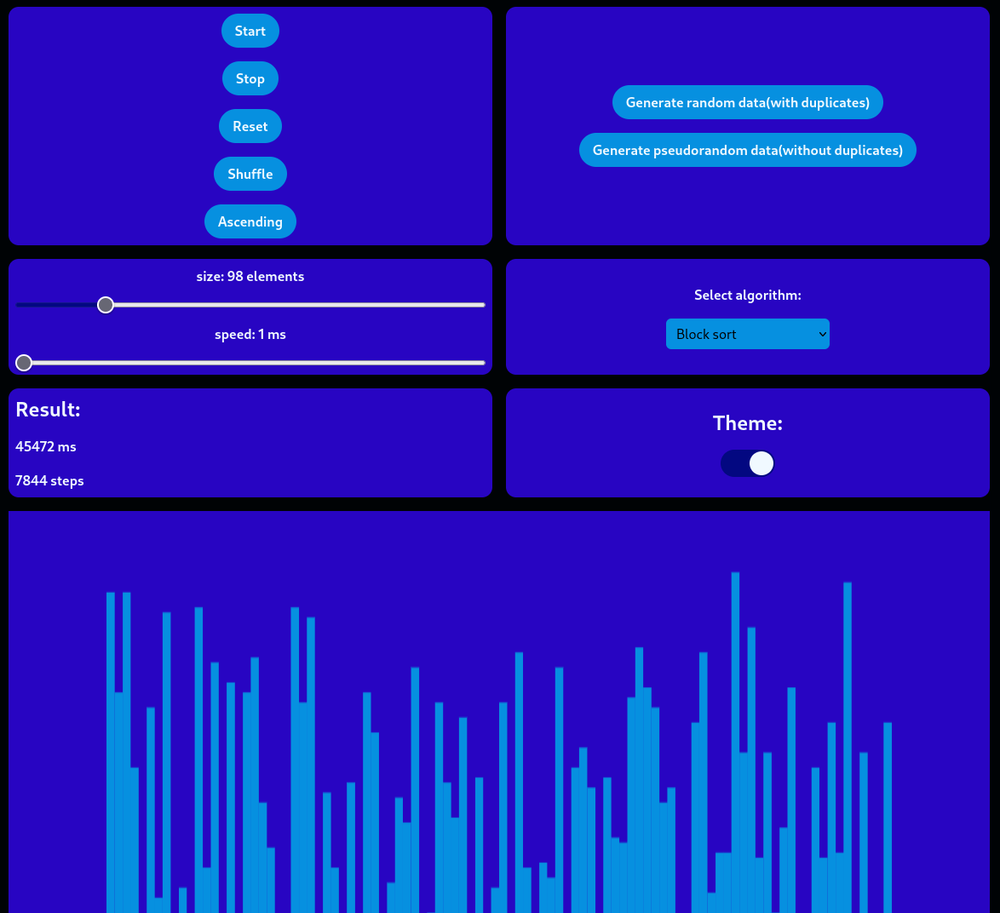

# Sort algorithms visualizer

This is a visualizer for different sort algorithms. It uses canvas to display data, HTML for input data and Typescript for sorting data.

[Demo](https://vasya-556.github.io/sort-algorithms-visualizer/)

# Table of Contents

- [Sort algorithms visualizer](#sort-algorithms-visualizer)
- [Table of Contents](#table-of-contents)
- [Usage](#usage)
- [Installation](#installation)
- [Tests](#tests)
- [Contrubuting](#contrubuting)
- [License](#license)

# Usage

The website contain 7 blocks.
1. **Control buttons**
Contains 4 buttons and switch. 
- Start 
Start to sort data
- Stop
Stop algorithm
- Reset
Reset data to the state before start button was pressed
- Shuffle
Shuffle the data
- Ascending(Descending)
Switch between ascending and descending orders for sorting
2. **Generate data buttons**
Contains two buttons: "Generate random data(with duplicates)" and "Generate pseudorandom data(without duplicates)". Both generate arrays of data that will be sorted.
3. **Control sliders**
Two sliders. One to choose size of data array and another to choose speed. Speed is a time betweeb each step.
4. **Algorithm selector**
A simple picker to choose algorithm
5. **Result panel**
Display how much time(in ms) and how much steps was needed to sort data.
6. **Theme switch**
Toggling the switch will change between light and dark mode on the website
7. **Canvas with data itself**
It just canvas to display data

# Installation

1. Clone repository 
```bash
git clone https://github.com/Vasya-556/sort-algorithms-visualizer
```
2. Go into project folder
```bash
cd sort-algorithms-visualizer
```
3. Install dependencies
```bash
npm install
```
4. Build
```bash
npx tsc
```
5. Open index.html with Live Server(or similiar)

# Tests

Run tests
```bash
npm test
```

# Contrubuting

Pull requests are welcome.

# License

[MIT](LICENSE)